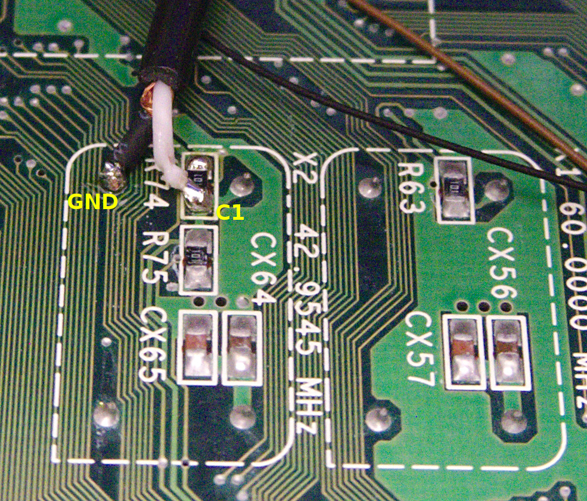
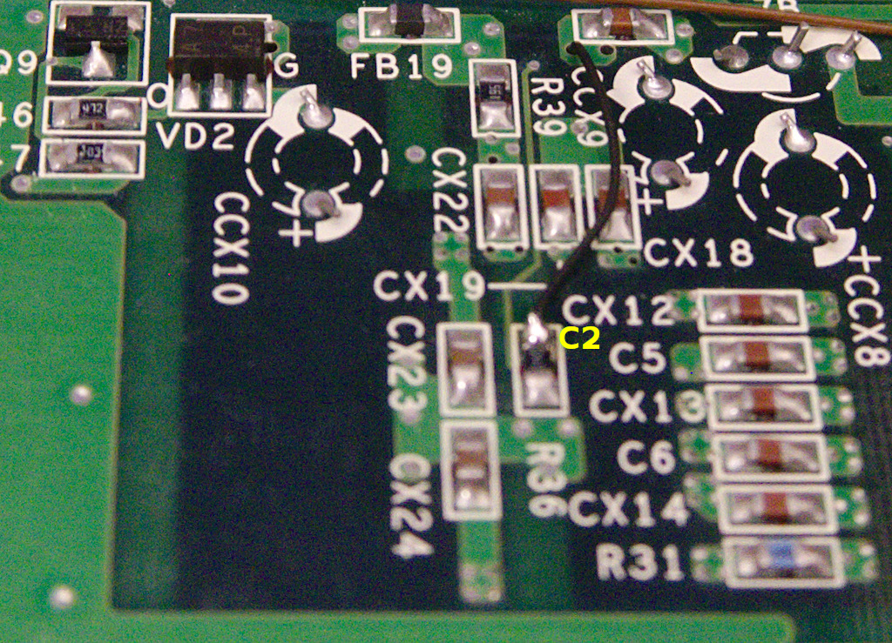
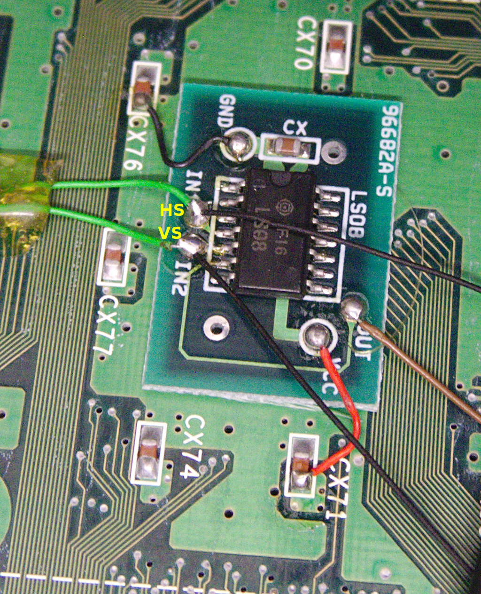
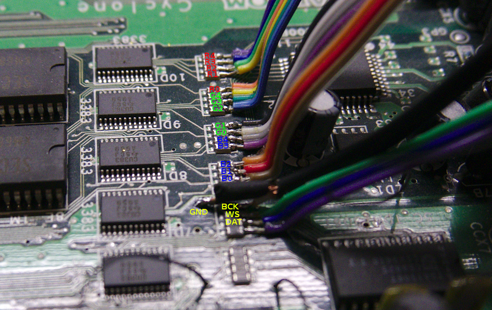
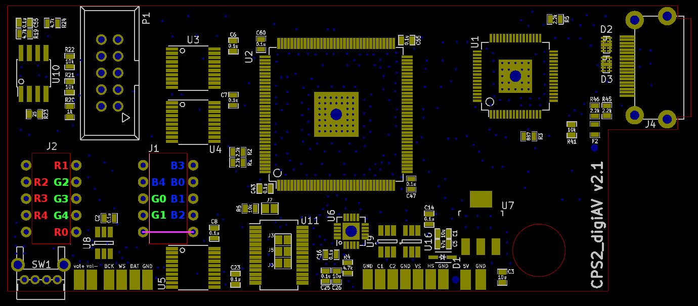
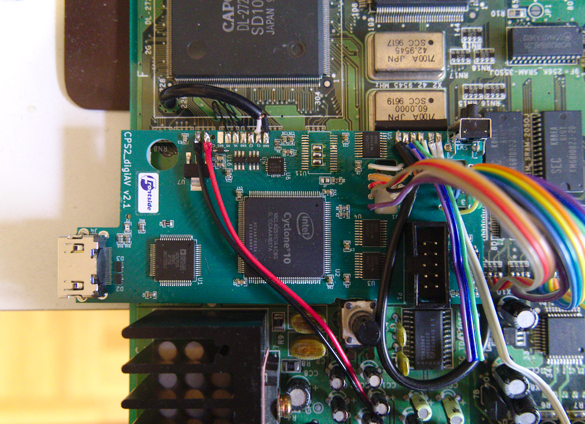

Step 1: clock and sync signals
--------------------------
Clocks and syncs are available on bottom side of CPS3 board. Extract 42.9545MHz clock (C1) from right side of R74 and video clock (C2) from left side of R36. For C1 it's mandatory to use a coax cable to avoid stability issues caused by noise. For C2 I was able to use a short kynar wire without issues, but depending on installation a coax might be needed as well. Horizontal and vertical sync are combined on factory-installed add-on board housing a LS08 chip. Extract HS from IN1 and VS from IN2. Some boards have HS connected IN2 and VS to IN1 - try swapping them if you don't get proper sync/picture. On later CPS3 revisions the LS08 might also be integrated on the mainboard.

  

Step 2: RGB, audio and power signals
--------------------------

RGB, audio and power are easily available on top side of CPS3. Extract RGB and audio signals from RN7-RN3 resistor arrays as shown in the first image below. For BCK it's highly recommended to use a coax cable. 5V and GND can be extracted near JAMMA connector as shown in the second image.

 

Step 3: Preparation of cps2_digiav board
--------------------------

Bridge SMD jumpers J3, J5 and J6 on top side of the PCB.

The board is operated via 2 keys which can be implemeted with one of the alternatives below:
* Wire vol-/vol+ pads to existing button lines on JAMMA connector (e.g. P1 credit & start).
* Install R7+R8 (2x10k 0603 SMD resistors) and SW1 (TL2243). SW1 can be substituted via 2pcs external buttons of which one end is connected to GND and other end to vol+/- pads.
* If using CPS2 I/O Interface, vol-/vol+ pads can be wired to its up/down keys (see parts list on main README). R7 and R8 need to be installed as well.

Step 4: RGB hookup to cps2_digiav board
--------------------------

RGB signals are hooked to socket footprint holes on cps2_digiav board as illustrated below. Add a jumper wire between the holes connected by a magenta line in the image to avoid a floating extra input pin.

Step 5: Finalization
--------------------------

Hook the remaining signals to cps2_digiav board. Use mounting tape to attach the board to a suitable place on CPS3 mainboard.

After installation, FPGA firmware (output_files/cps2_digiav.jic) needs to be flashed (if board wasn't pre-flashed) via JTAG using Altera USB Blaster -compatible programmer while CPS3 is powered on.
