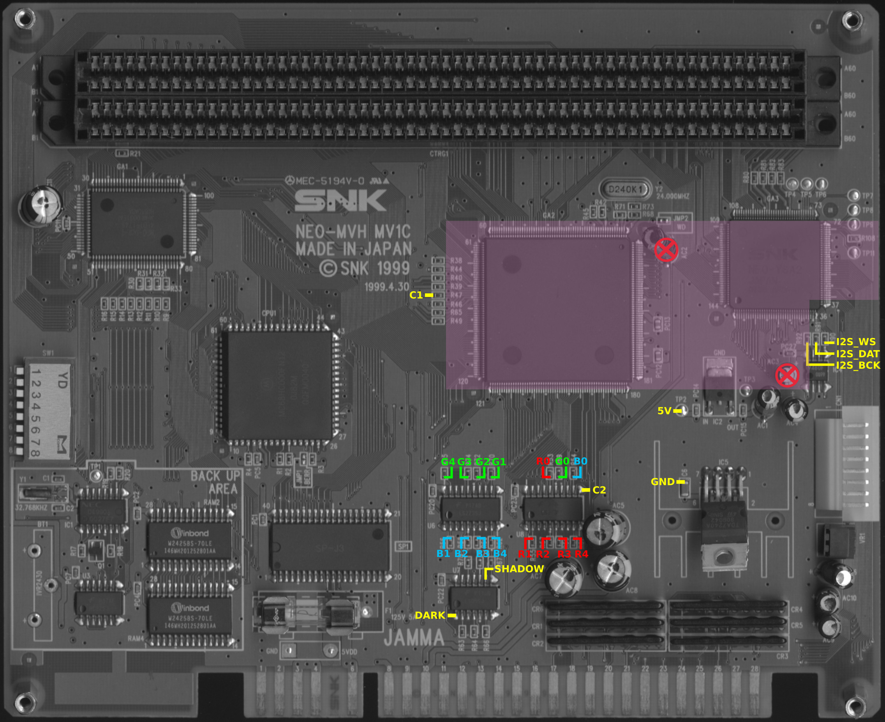
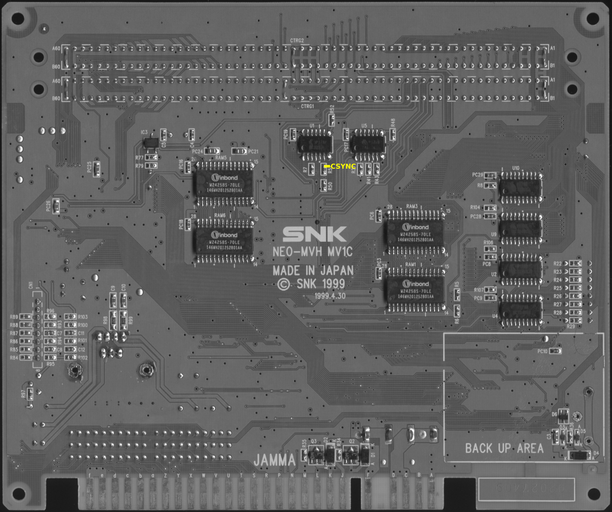
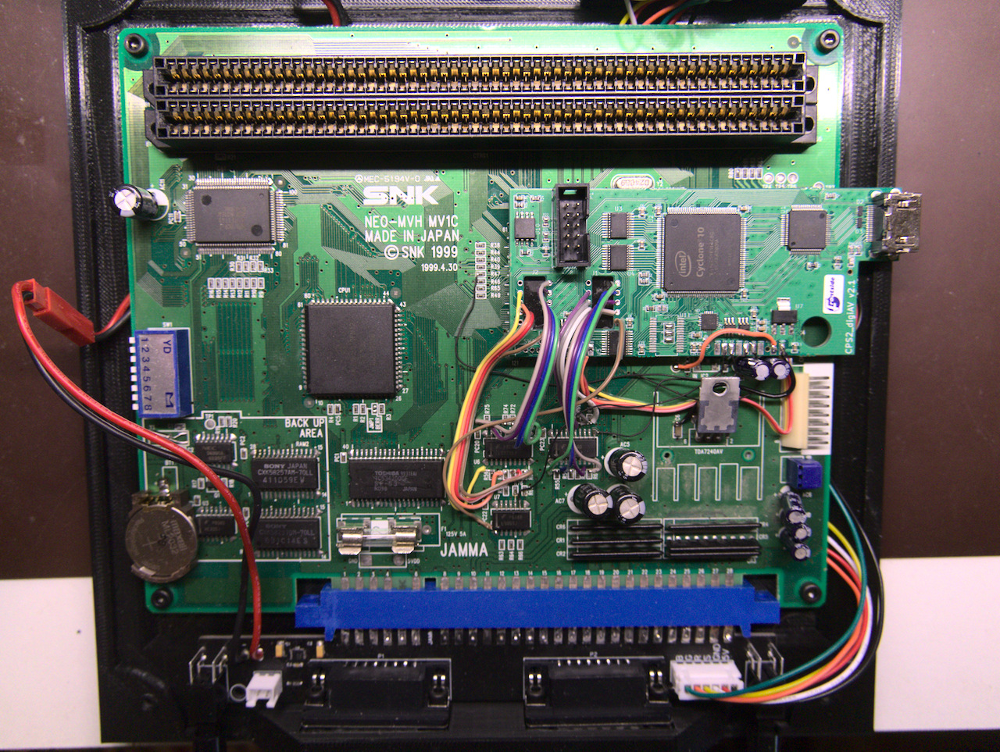

Neo Geo (MV1C) signal reference
--------------------------

[List of hookup points](./mv1c_hookup_points.txt)

Step 1: Preparation of MV1C
--------------------------

1. If you plan on installing the board on the shaded area which is selected to minimize wire distances, remove 2 marked electrolytic caps (AC2-3) and replace them with SMD ceramic caps (I used 0805 10uF ones).

2. Attach mounting tape pieces on top of GA2 and GA3 chips if the board is installed on the recommended place. Don't remove protective layer from top of the mounting tape yet since some hookup points are beneath the area where cps2_digiav PCB is to be placed.

Step 2: Preparation of cps2_digiav board
--------------------------

1. Bridge SMD jumpers J3, J5 and J6 on cps2_digiav board.

2. Solder R7+R8 (2x10k 0603 SMD resistors) on bottom of cps2_digiav board. If you want to add on-board button module for operation control, solder SW1 (TL2243). For external buttons (2pcs), connect their one end to GND and other end to btn_vol+/- pad.

3. Cut a 10cm piece of 16 conductor ribbon cable and split in into following pieces: 5 conductor (1pcs), 4 conductor (1pcs), 3 conductor (2pcs), 1 conductor (1pcs). Strip both ends of the wires and solder them to named holes around J1/J2 footprints on cps2_digiav as shown in the picture below (solitary wire for DARK). Tin their other ends so that they can be easily soldered on SMD caps on MV1C.

Step 3: Power signals
--------------------------

Connect 5V and GND points of MV1C to respective pads on cps2_digiav board with 2 short and sturdy wires.

Step 4: Clock and sync signals
--------------------------

Use 3 kynar wires to connect C1, C2 and CSYNC (bottom side) points of MV1C to cps2_digiav. Bring CSYNC wire on top side through one of the vias near TP2 and connect it to HS pad.

Step 5: Audio signals
--------------------------

Hook WS, DAT and BCK signals to cps2_digiav with a 3 conductor ribbon cable.

Step 6: Board attachment
--------------------------

Now that all signals except video are connected, remove the protective layer from mounting tape pieces and secure cps2_digiav board on its place.

Step 7: Video signals
--------------------------

Connect 15 RGB wires from step 2 to the marked SMD resistors (LS273 side) on MV1C and hook 16th wire (DARK) to PC22 pin 1. As the last step, connect SHADOW (PC22 pin 9) to VS pad of cps2_digiav.

