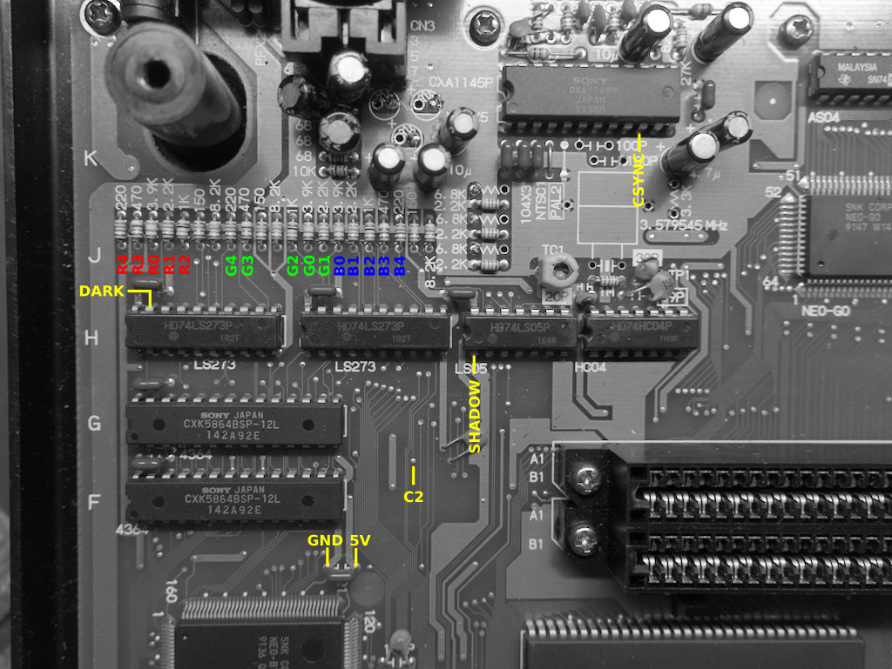
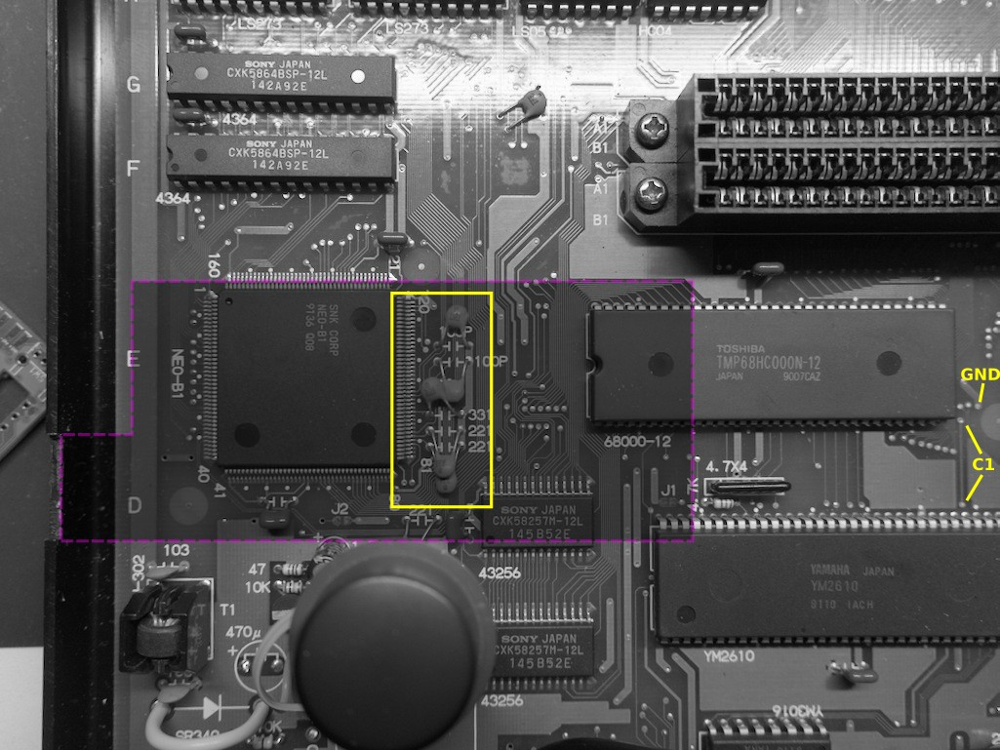
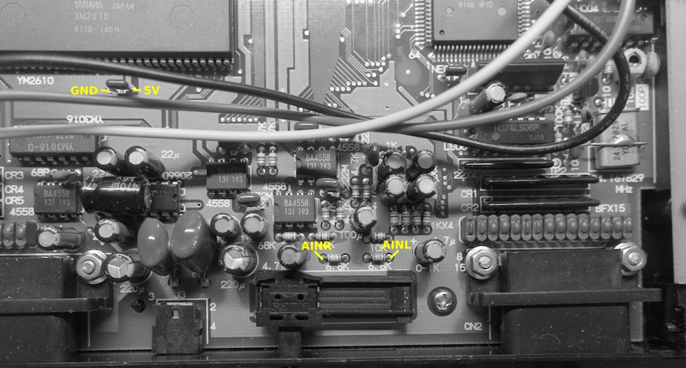
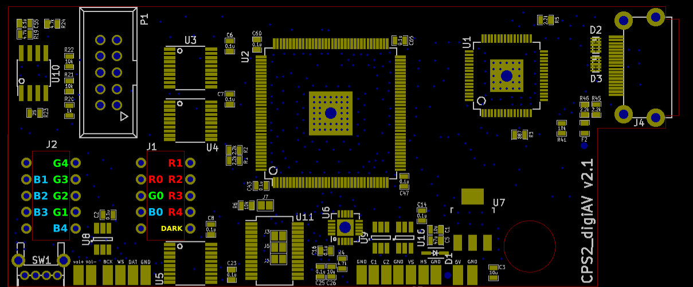
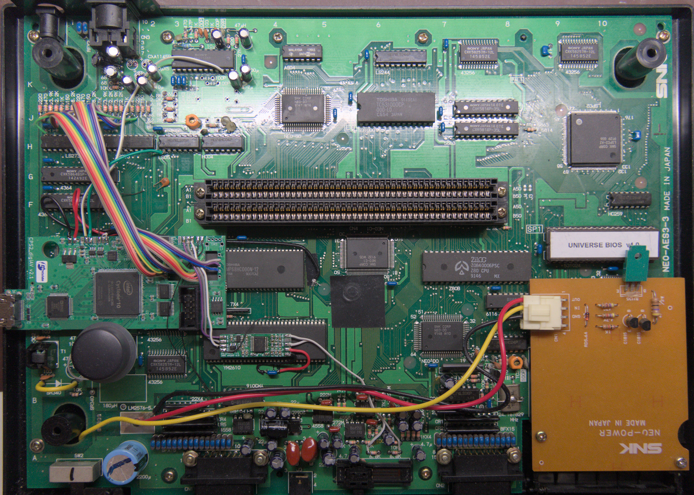

Neo Geo (NEO-AES3-3) signal reference
--------------------------

[List of hookup points](./aes3-3_hookup_points.txt)

Step 1: Preparation of cps2_digiav board
--------------------------

1. Bridge SMD jumpers J3, J5 and J6 on cps2_digiav board.

2. The board is operated via 2 keys which can be implemeted either by wiring vol-/vol+ pads to existing button lines on controller ports (e.g. P1 credit & D) or by using separate buttons. In the latter case, solder R7+R8 (2x10k 0603 SMD resistors) on bottom of cps2_digiav board and connect one end of the buttons to GND and other end to vol+/- pads.

3. Cut a 10cm piece of 16 conductor ribbon cable and split in into following pieces: 5 conductor (1pcs), 4 conductor (1pcs), 3 conductor (1pcs), 1 conductor (4pcs). Strip both ends of the wires and solder them to named holes around J1/J2 footprints on cps2_digiav as shown in the picture below (solitary wires for R0, G0, B0 and B4). Cut / trim the soldered ends since they will otherwise hinder installation. Tin other ends of the wires so that they can be easily soldered on the resistors on AES.

Step 2: Preparation of AES3-3
--------------------------

1. If you plan on installing the board on the shaded area which is selected to minimize wire distances, bend down the capacitors in the yellow rectangle and make a small cutout for HDMI connector on lower part of the case.

2. Attach mounting tape pieces on top of NEO-B1 (double layer) and under cps2_digiav between the cutouts if the board is installed on the recommended location. Secure cps2_digiav board on its place.

Step 3: Power signals
--------------------------

Connect nearest 5V and GND points of AES to respective pads on cps2_digiav board with 2 short and sturdy wires.

Step 4: Clock and sync signals
--------------------------

Use coax cable for C1 and connect GND on both ends (cover unused vias next to upper C1 connection point on AES with electrical tape to avoid shorting them). C2 and CSYNC can be connected with kynar or similar thin wires.

Step 5: Audio signals
--------------------------

Install audio ADC board on top of YM2610 with mounting tape. Hook WS, DAT and BCK signals to cps2_digiav with a 3 conductor ribbon cable etc. Connect AILR and AINR pads to AES, and 5V and GND pads to nearest capacitor.

Step 6: Video signals
--------------------------

Connect 15 RGB wires from step 1 to the marked resistors (south side) on AES and hook 16th wire (DARK) to leftmost LS273 pin 19. As the last step, connect SHADOW (LS05 pin 1) to VS pad of cps2_digiav.

Step 7: Finalization
--------------------------

Power up and verify both audio and video works. Open cps2_digiav menu, select AES from XTAL freq option and save settings. Make a cutout on the upper part of AES case and put everything together.

