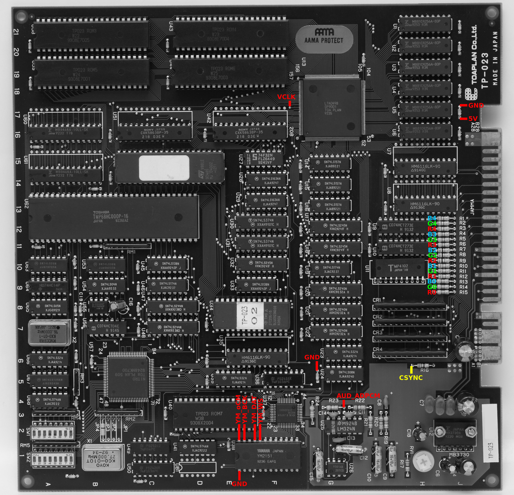
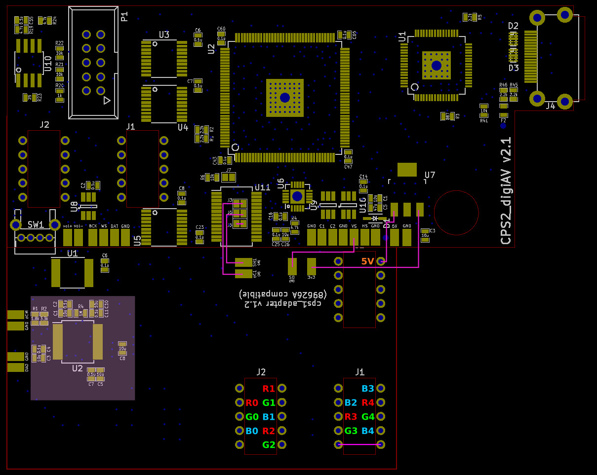
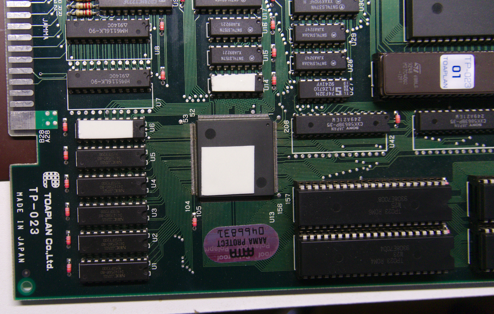

Toaplan V2 (Knuckle Bash) signal reference
--------------------------
This guide is for Knuckle Bash PCB. Installation to other Toaplan V2 boards should be similar.

[List of hookup points](./toaplan2_hookup_points.txt)

Step 1: Preparation of cps2_digiav board
--------------------------

Solder R7+R8 (2x10k 0603 SMD resistors) on bottom of cps2_digiav board. If you want to add on-board button module for operation control, solder SW1 (TL2243). For external buttons (2pcs), connect their one end to GND and other end to btn_vol+/- pad.

Step 2: Preparation of cps1_adapter+cps2_digiav combo
--------------------------

1. Install cps2_digiav on top of cps1_adapter board via 4pcs 5-pin headers as illustrated below

2. Bridge SMD jumpers J3, J5 and J6 on cps2_digiav board

3. Connect the following pads with 6 short wires as shown in the illustration (magenta lines):

* J3 (cps2_digiav) <-> oC1 (cps1_adapter)
* J5 (cps2_digiav) <-> SH1 (cps1_adapter)
* VS (cps2_digiav) <-> SO (cps1_adapter)
* U7 rightmost pin (cps2_digiav) <-> 3v3 (cps1_adapter)
* U7 leftmost pin (cps2_digiav) <-> 5V (cps1_adapter)
* J1 pins (cps1_adapter) on the bottom 

4. Cut 10cm piece of 15 conductor ribbon cable and split in into following pieces: 5 conductor (1pcs), 4 conductor (1pcs), 3 conductor (2pcs). Strip both ends of the wires and connect other ends to named holes around J1/J2 footprints on cps1_adapter (ref. image below). 

Step 3: Preparation of Toaplan V2 board
--------------------------

Place 3 mounting tape pieces on top of the Toaplan V2 chips as shown below. Before attaching the adapter combo, solder short wires on 5V/GND pair near Toaplan logo. Then position and place the mod board combination on Toaplan PCB and connect other ends of the 5V/GND wires on respective pads on cps2_digiav board. Lastly, connect VCLK from other side of adapter combo to C1 and C2 pads on cps2_digiav board. Preferably use as short as possible kynar wire and route it underside the mod board combination.

Step 4: Video and sync signals
--------------------------

Connect other ends of the ribbon cable groups (from step 2) to R2R DAC resistors near JAMMA connector. Connect CSYNC from R16 to HS pin on cps2_digiav board.

Step 5: Audio signals
--------------------------

OPM audio is extracted from YM2151 and ADPCM audio from R23. Use coax cables to connect YM_oCM and AUD_ADPCM signals to corresponding pads (oCM and DAO) on cps1_adapter. Connect grounds on both ends to the nearest places as designated. Lastly, use a pice of ribbon cable to connect YM_BCK, YM_DAT and YM_WS to corresponding pads (BCK, DAT and WS) on cps2_digiav. Avoid running the cable on top of noise-sensitive area around U2 on cps1_adapter (shaded in the earlier illustration).

