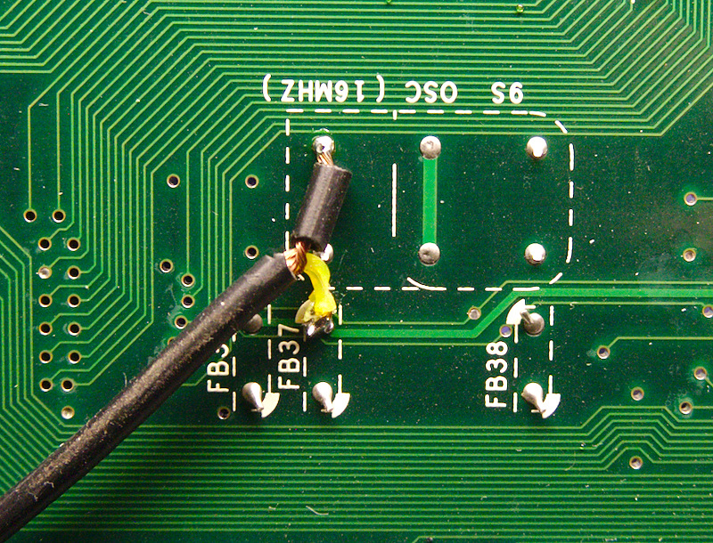
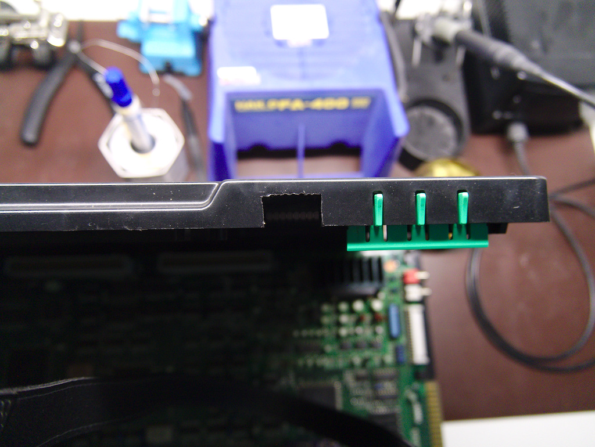

A-board signal reference
--------------------------
[List of hookup points](./cps2_hookup_points.txt)

Step 1: clock and sync signals
--------------------------
Clock is available on bottom side of A-board. Extract 16MHz clock (C1) below the oscillator as shown in the image below. It's mandatory to use a coax cable to avoid stability issues caused by noise. Horizontal and vertical sync signals can be extracted from 7S - PAL (BGSA5) as shown in signal reference.

Step 2: RGB, audio, power and button signals
--------------------------

2pcs U-shaped 2x5 headers are used to tap RGB signals from M5M RAM chips as shown in the image below. Audio is extracted from 10J - TDA1543 as shown in signal reference and power can be easily taken e.g. from empty CCX cap footprints. Vol- and vol+ signals are taken from respective buttons as shown in signal reference.

Step 3: Preparation of cps2_digiav board
--------------------------

Solder BCS-105-L-D-PE-BE sockets on their places and trim down pin metals underside the PCB. Bridge SMD jumpers J3, J5 and J6 on top side of cps2_digiav PCB.

Step 4: Board installation
--------------------------

Place the add-on board on top of the CPS2 board so that the sockets are aligned to headers. Connect all signal & power wires, and add a jumper wire between cps2_digiav C1 and C2 pads.

Step 5: Finalization
--------------------------

Make a small cutout for HDMI connector in the CPS2 case as illustrated below. If you want to enable later access to JTAG connector without the need of removing top part of A-board case (which also tends to lift up the add-on board), there are two options. It's possible to either replace the JTAG connector with an extension cable that goes outside of the case, or make another cutout on the A-board case on top of the connector.

Before closing the case, FPGA firmware (output_files/cps2_digiav.jic) needs to be flashed (if board wasn't pre-flashed) via JTAG using Altera USB Blaster -compatible programmer while CPS2 is powered on.
